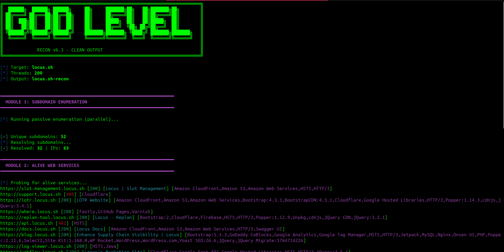

# DEAD RECON v6.1

A fast, clean reconnaissance framework for **bug bounty hunters & security researchers**.

## Features
- Subdomain enumeration
- DNS resolution & alive host detection
- URL discovery (Wayback, GAU, crawling)
- Smart URL categorization (params, APIs, JS)
- Basic vulnerability signals
- Nuclei integration
- ASN & network intelligence
- Clean, noise-free output





## Usage
```bash
chmod +x Recon.sh
./Recon.sh example.com
./Recon.sh example.com 200
